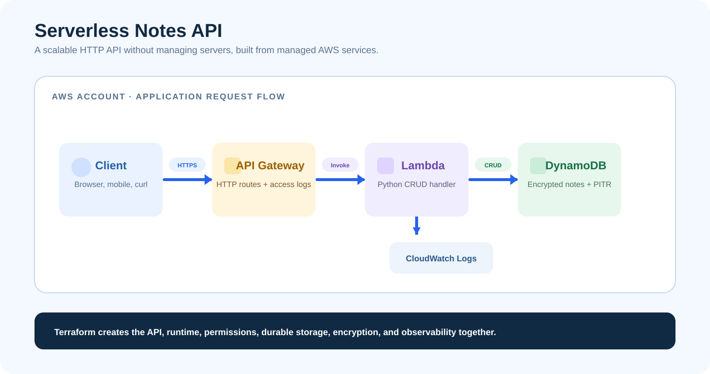

# Serverless Notes API with Terraform

Project 04 deploys a production-style serverless CRUD API using API Gateway,
Lambda, DynamoDB, least-privilege IAM, and CloudWatch Logs.

## Architecture



## Resources

- API Gateway HTTP API with `GET`, `POST`, and `DELETE` note routes
- Python 3.12 Lambda function packaged by Terraform
- DynamoDB PAY_PER_REQUEST table with encryption and point-in-time recovery
- Scoped Lambda IAM policy for only the table and log group
- CloudWatch Logs and API access logs with 30-day retention

## Structure

```text
├── api.tf          # API Gateway integration, routes, stage, invoke permission
├── lambda.tf       # Lambda package, runtime role, logs
├── database.tf     # DynamoDB table
├── lambda/index.py # Application code
├── diagrams/       # Architecture infographic
└── outputs.tf      # API endpoint and resource names
```

## Deploy

```bash
git clone https://github.com/siddhantbhattarai/terraform-aws-serverless-notes-api.git
cd terraform-aws-serverless-notes-api
cp terraform.tfvars.example terraform.tfvars
aws sts get-caller-identity
terraform init
terraform fmt -check
terraform validate
terraform plan
terraform apply
```

## Verify

```bash
API_URL=$(terraform output -raw api_endpoint)
curl -X POST "$API_URL/notes" -H 'content-type: application/json' -d '{"content":"First Terraform note"}'
curl "$API_URL/notes"
```

Verify the HTTP API routes, Lambda logs, DynamoDB recovery setting, and IAM
role in the AWS Console. Remove all resources with `terraform destroy`.
